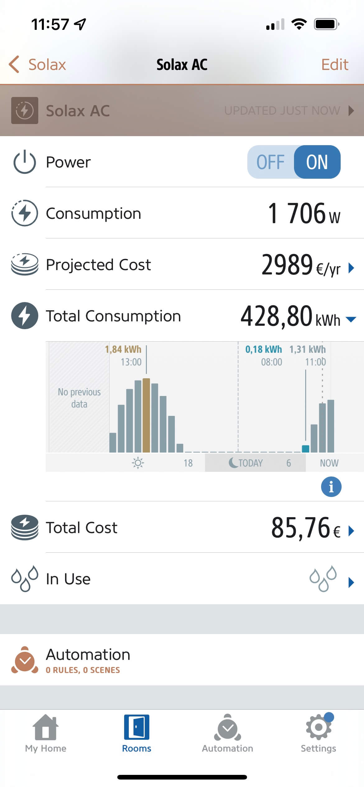

<table cellspacing="0" cellpadding="0">
  <tr>
    <td align="center"></td>
    <td align="center"></td>
  <tr>
</table>

# Solax Cloud Plugin for Homebridge

  [](https://github.com/homebridge/homebridge/wiki/Verified-Plugins)


The Solax Cloud Plugin for [Homebridge](https://homebridge.io/) was created as a platform plugin to gather data exposed by Solax inverters to the cloud through the [Solax Cloud API](https://www.eu.solaxcloud.com/phoebus/resource/files/userGuide/Solax_API_for_End-user_V1.0.pdf).

As HomeKit is still clueless about what a solar panel is, this plugin exposes a set of standard HomeKit accessories though Homebridge that will allow interacting and automating your smart home based on the data made available from the Solax platform:

- **PV** (PV outlet with power consumption)
- **AC** (Inverter AC outlet with power and total energy consumptions)
- **To Grid** (Inverter to Grid outlet with power consumption)
- **To House** (Inverter to House outlet with power consumption)
- **From Grid** (Grid to House outlet with power consumption)
- **Update** (Motion sensor)


 
## Required information

For this plugin to work, two critical pieces of information are required: 

- **Token ID**: Solax users can get inverter information through the granted tokenID. You need to obtain your tokenID on the API page of Solaxcloud.
- **SN**: Registration No (communication module SN).

## Installation

This plugin is supported under Homebridge. It is highly recommended that you use Homebridge Config UI X to install and configure this plugin.

### Manual Installation

Install this plugin using: `sudo npm install -g homebridge-solaxcloud-api`.
Edit `config.json` manually to add your Solax inverters. See below for instructions on that.

## Platform configuration

Minimal platform configuration is depicted by the example configuration file below:

```json
{
  "platforms": [
    {
      "platform": "SolaxCloudAPI",
      "name": "My Solax",
      "tokenId": "20200722185111234567890",
      "sn": "ABCDEFGHIJ"
    }
  ]
}
```
Configuration parameters are described on the table below:

| **Parameter**      | **Type** |  **Description**                                                                                                                |  **Default**  | **Mandatory?** |
| ------------------ | -------- | ------------------------------------------------------------------------------------------------------------------------------- | -------------:| :------------: |
| `platform`         |  string  |  Platform name (must be SolaxCloudAPI)                                                                                          |     -         |       Y        |
| `name`             |  string  |  Inverter name, used as prefix for accessory naming                                                                             |     -         |       Y        |
| `tokenId`          |  string  |  Users get information from Solax Cloud through the granted tokenID. Please obtain your tokenID on the API page of Solax Cloud. |     -         |       Y        |
| `sn`               |  string  |  Registration No. (inverter module SN)                                                                                          |     -         |       Y        |
| `pollingFrequency` |  number  |  Plugin data polling frequency from Solax Cloud (in seconds)                                                                    |     300       |       N        |
| `smoothingMeters`  |  boolean |  Whether to create additional meters by smoothing raw values from Solax Cloud                                                   |     true      |       N        |
| `pureHomeApp`      |  boolean | Whether to create meters as standard accessories that can be used on the Home App (power will show as ambient light sensors).   |     false     |       N        |

**NOTE:** The `pollingFrequency` parameter defaults to 300 seconds, since Solax inverters update cloud data every 5 minutes.

Configuration through the the use of [Homebridge UI](https://github.com/oznu/homebridge-config-ui-x) plugin is also available and recommended:


## Non-standard characteristics

Non-standard accessory characteristics are available through the use of [Eve for HomeKit app](https://apps.apple.com/us/app/eve-for-homekit/id917695792) you may download from the App Store.

This will allow some important non-standard characteristics to be visible (like power or total energy consumption), as depicted in the image below:



If you want to rely solely on the native Home App, please enable the `pureHomeApp` config setting by editing the `config.json` file or using Homebridge UI. In this case, power consumption on each meter will be exposed as an Ambient Light Sensor, as shown below (minimum value for an Ambient Light Sensor is 0.1 lux):


# Automation

Automation can be achieved with the help of the virtual **Update** motion sensor that was specifically tailored for this effect. This motion sensor will be triggered whenever data gets updated from the Solax Cloud API (according to what is defined on the `pollingFrequency` configuration setting). 


Motion is detected by the **Update** motion sensor whenever there is newly fetched data from Solax Cloud. Using this sensor as a trigger combined with power and energy data from the virtual outlets enumerated above forms the basic building blocks for defining an automation.

## Automation example

Since automations are probably going to be dependent on the non-standard **Consumption** characteristics from the virtual outlets, these must created by using the Eve App. 

As an automation example, let's imagine we want to turn a pool heater pump on whenever the inverter AC power is greater than a specific figure (in Watt):

<table cellspacing="0" cellpadding="0">
  <tr>
    <td width="50%">1. Under Automation, select <b>Rules</b></td>
    <td width="50%">2. Click <b>Next</b></td>
  </tr>
  <tr>
    <td></td>
    <td></td>
  </tr>
  <tr>
    <td>3. Click <b>Add Trigger</b></td>
    <td>4. Select <b>Motion</b> as trigger type</td>
  </tr>
  <tr>
    <td></td>
    <td></td>
  </tr>
  <tr>
    <td>5. Select the Solax <b>Update</b> motion detector and set <b>Motion</b> as trigger</td>
    <td>6. Click <b>Next</b></td>
  </tr>
  <tr>
    <td></td>
    <td></td>
  </tr>
  <tr>
    <td>7. Select <b>Add Value Condition</b></td>
    <td>8. Choose <b>Inverter AC Consumption</b> as characteristic and elect <b>&gt=</b> a desired value</b></td>
  </tr>
  <tr>
    <td></td>
    <td></td>
  </tr>
  <tr>
    <td>9. Click <b>Next</b></td>
    <td>10. If no scene exists, click <b>Add Scene</b></td>
  </tr>
  <tr>
    <td></td>
    <td></td>
  </tr>
  <tr>
    <td>11. Click <b>Add Actions</b></td>
    <td>12. Select the accessory to be controlled (in this case <b>Garden Pool Outlet</b> will be turned <b>ON</b>)</td>
  </tr>
  <tr>
    <td></td>
    <td></td>
  </tr>
  <tr>
    <td>13. Click <b>Next</b></td>
    <td>14. Name your scene and click <b>Done</b></td>
  </tr>
  <tr>
    <td></td>
    <td></td>
  </tr>
  <tr>
    <td>15. Click <b>Next</b></td>
    <td>16. Name your rule and click <b>Done</b></td>
  </tr>
  <tr>
    <td></td>
    <td></td>
  </tr>
</table>

# TO DO

Next planned plugin releases should include:

- [X] **Inverter AC** to include Yield Energy
- [X] Consumption history through the [fakegato-history](https://github.com/simont77/fakegato-history) module
- [x] Enable support for "pure" Home App accessories (power meters will be exposed as Ambient Light sensors)
- [x] Add "smooth" accessories for power meters (compensating for sporadic scenarios like cloud a passing)
- [ ] Accessories for battery state and consumptions (do not have one available)
