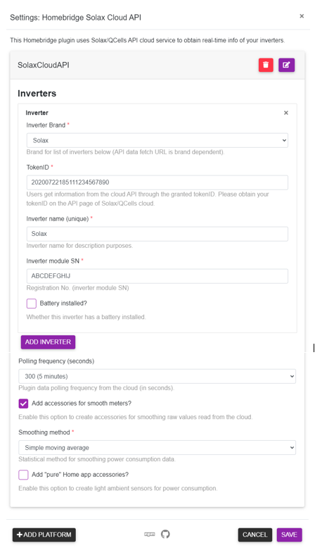

<p align="center">


</p>


# Solax Cloud Plugin for Homebridge


This Homebridge platform plugin was created to gather data from the Solax Cloud API (as documented in the official [Solax Cloud API](https://www.eu.solaxcloud.com/phoebus/resource/files/userGuide/Solax_API_for_End-user_V1.0.pdf)) by relying on the provided TokenID and SN.

This Solax Cloud Plugin will expose a set of Homekit accessories though Homebridge that will allow interacting and (potentially) aumotating your smart home based on the data available from the Solax platform:

- Inverter PV (outlet with power consumption)
- Inverter AC (outlet with power consumption)
- Inverter to Grid (outlet with power consumption)
- Inverter to House (outlet with power consumption)
- Grid To House (outlet with power consumption)
- Update (Motion sensor)

## Required information

For this plugin to work, two critical pieces of information are required: 

- **Token ID**: Solax users can get inverter information through the granted tokenID. You need to obtain your tokenID on the API page of Solaxcloud.
- **SN**: Registration No (communication module SN).

## Platform configuration

Minimum platform configuration is depicted by the example configuration file below:

```json
{
  "platforms": [
    {
      "platform": "SolaxCloudAPI",
      "name": "My Solax",
      "tokenId": "20200722185111234567890",
      "sn": "ABCDEFGHIJ",
      "pollingFrequency": 60
    }
  ]
}
```
Configuration through the the use of Homebridge UI plugin is also available:



## Non-standard characteristics

Non-standard accessory characteristics are available through the use of [Eve for HomeKit app](https://apps.apple.com/us/app/eve-for-homekit/id917695792) you may download from the App Store.

This will allow some important characteristics to be visible (e.g.: consumption), as depicted in the image below:


# Automation

Automation can be achived with the help of the virtual "Update" motion sensor that was specifically tailored for this effect. This motion sensor will be triggered whenever data gets updated from the Solax Cloud API (according to the `pollingFrequency` configuration setting). 

IMAGE HERE

This implies data was refreshed for each of the virtual outlets enumerated above and may be used for further defining an automation.

## Automation example

As an automation example

# TO DO

Next planned plugin releases should include:

- Inverter AC (to include Yield energy)
- History through [fakegato-history](https://github.com/simont77/fakegato-history) module
