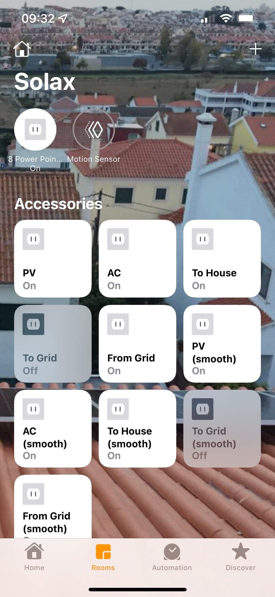
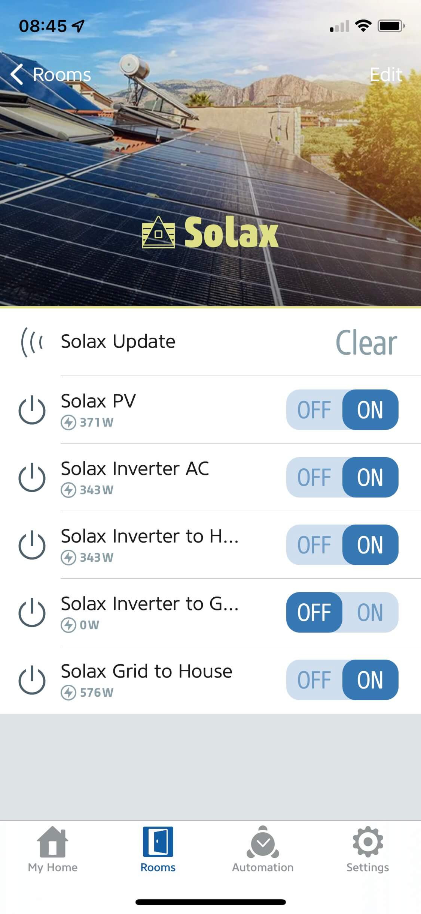

<table cellspacing="0" cellpadding="0">
  <tr>
    <td align="center"></td>
    <td align="center"></td>
  <tr>
</table>

# Solax Cloud Plugin for Homebridge

 


The Solax Cloud Plugin for [Homebridge](https://homebridge.io/) was created as a platform plugin to gather data exposed by Solax inverters to the cloud through the [Solax Cloud API](https://www.eu.solaxcloud.com/phoebus/resource/files/userGuide/Solax_API_for_End-user_V1.0.pdf).

As HomeKit is still clueless about what a solar panel is, this plugin exposes a set of standard HomeKit accessories though Homebridge that will allow interacting and automating your smart home based on the data made available from the Solax platform:

- **Inverter PV** (outlet with power consumption)
- **Inverter AC** (outlet with power and total energy consumptions)
- **Inverter to Grid** (outlet with power consumption)
- **Inverter to House** (outlet with power consumption)
- **Grid To House** (outlet with power consumption)
- **Update** (Motion sensor)


 
## Required information

For this plugin to work, two critical pieces of information are required: 

- **Token ID**: Solax users can get inverter information through the granted tokenID. You need to obtain your tokenID on the API page of Solaxcloud.
- **SN**: Registration No (communication module SN).

## Installation

This plugin is supported under Homebridge. It is highly recommended that you use Homebridge Config UI X to install and configure this plugin.

### Manual Installation

Install this plugin using: `sudo npm install -g homebridge-solaxcloud-api`.
Edit `config.json` manually to add your Solax inverters. See below for instructions on that.

## Platform configuration

Minimum platform configuration is depicted by the example configuration file below:

```json
{
  "platforms": [
    {
      "platform": "SolaxCloudAPI",
      "name": "My Solax",
      "tokenId": "20200722185111234567890",
      "sn": "ABCDEFGHIJ",
      "pollingFrequency": 60
    }
  ]
}
```
**NOTE:** The `pollingFrequency` parameter is optional and defaults to 300 seconds, since Solax inverters update cloud data every 5 minutes.

Configuration through the the use of [Homebridge UI](https://github.com/oznu/homebridge-config-ui-x) plugin is also available and recommended:


## Non-standard characteristics

Non-standard accessory characteristics are available through the use of [Eve for HomeKit app](https://apps.apple.com/us/app/eve-for-homekit/id917695792) you may download from the App Store.

This will allow some important non-standard characteristics to be visible (like power or total energy consumption), as depicted in the image below:


# Automation

Automation can be achieved with the help of the virtual **Update** motion sensor that was specifically tailored for this effect. This motion sensor will be triggered whenever data gets updated from the Solax Cloud API (according to what is defined on the `pollingFrequency` configuration setting). 



Motion is detected by the **Update** motion sensor whenever there is newly fetched data from Solax Cloud. Using this sensor as a trigger combined with power and energy data from the virtual outlets enumerated above forms the basic building blocks for defining an automation.

## Automation example

Since automations are probably going to be dependent on the non-standard characteristic from the virtual outlets, these can be created by using the Eve App. As an automation example...

# TO DO

Next planned plugin releases should include:

- [X] **Inverter AC** to include Yield Energy
- [X] Consumption history through the [fakegato-history](https://github.com/simont77/fakegato-history) module
- [ ] Accessories for battery state and consumptions (do not have one available)
